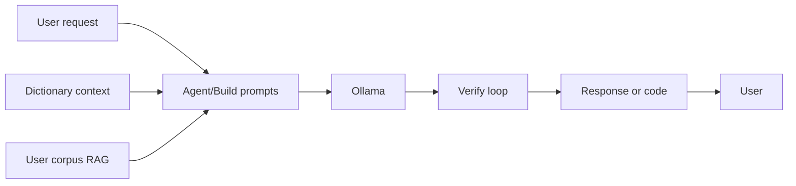

# Tailored Agent / Twin Roadmap (Local + Handbook)

This roadmap describes how to turn the app into a **user-tailored agent/twin**: an assistant that grounds the model in a coding dictionary and optional user corpus, adds a verify loop for generated code, and optionally uses templates for common patterns—building on the existing agent kernel and Build flow.

Builds on the agent kernel and tools in [AGENT_ROADMAP.md](AGENT_ROADMAP.md).

---

## Sources

| Source | What it contributes |
|--------|---------------------|
| **Local DictAgent** (`Local\Local`) | Coding dictionary (word → pos, def); `retrieve(query)` for context; templates (e.g. react_form); `run_code` / `run_tests` / LLM judge; iterative generate → verify → retry loop. |
| **LLM Engineer's Handbook** ([PacktPublishing/LLM-Engineers-Handbook](https://github.com/PacktPublishing/LLM-Engineers-Handbook)) | Twin concept (user data → personalized model or behavior); RAG; data ETL and dataset pipelines; training/fine-tuning (optional later phase). |
| **This app** | [backend/app/services/agent_kernel.py](backend/app/services/agent_kernel.py), [backend/app/services/builder_service.py](backend/app/services/builder_service.py); Build + Agent UI; human-in-the-loop. |

---

## Phases (ordered roadmap)

### Phase 1 – Dictionary grounding

- Add or reuse a **coding dictionary** (Local-style: word → pos, def). Can be built from a starter vocab + WordNet or from an existing `coding_dictionary.json`.
- Implement **`retrieve(query)`** (keyword or simple semantic match over dictionary entries) and inject **"Dictionary context: …"** into agent and/or Build prompts.
- **Integration points:** agent kernel system prompt in `agent_kernel.py`; `conversation_to_spec` and `spec_to_code` in `builder_service.py`.
- Optional: **user-augmented dictionary** (user-specific terms from corpus or settings).

### Phase 2 – Verify loop

- After generating code (Build or agent edit): run in a **sandbox** (`run_code`), optional **`run_tests`**, and an **LLM judge** (score 0–100) to rate how well the code matches the request.
- Optional **retry** if score is below a threshold; surface **"Self-check: X/100"** or **"Retrying…"** in the UI.
- Reuse or port Local’s judge pattern (small Ollama call with "Rate 0–100… Output ONLY a number").
- Keep **human-in-the-loop** (approval) as-is; verify loop runs before or after approval as a quality signal.

### Phase 3 – RAG twin (no training)

- **User corpus:** let the user upload or import their text/code (or collect via a simple ETL); store chunks in a **local vector store** (e.g. SQLite + sqlite-vec, or Chroma / Qdrant local).
- At request time: **retrieve** top-k chunks for the query (and optionally a fixed "user style" set); inject **"Your style / preferences: …"** into the system or user prompt.
- Same Ollama model; **twin-like behavior** via retrieval + prompt shaping, no fine-tuning.

### Phase 4 – Templates for common patterns

- For **known patterns** (e.g. "login form", "CRUD endpoint"), use Local-style **templates** + dictionary retrieval; Ollama fills slots only.
- For **full app descriptions**, keep current `conversation_to_spec` → `spec_to_code`, with dictionary + optional RAG context already added in Phases 1 and 3.
- Hybrid: template path for speed and consistency; spec→code path for one-off or complex apps.

### Phase 5 (optional) – Real twin training

- Handbook-style pipeline: user data → **instruct** and **preference (DPO)** datasets → **fine-tune** (e.g. via Ollama or external training); use the resulting model as the agent model.
- Defer to later; document as a future phase when moving beyond RAG-based twin.

---

## Data flow (combined)

---

## Traits that make the combined app better

- **Constrained + user vocabulary:** Dictionary and optional user terms reduce hallucination and keep output consistent with the user’s language.
- **Two-layer grounding:** Code layer (dictionary + workspace) and user layer (RAG over user corpus) so the same model is both code-aware and user-tailored.
- **Verify before/after approval:** Run/test/judge loop gives a quality signal and optional retry; human approval stays for safety.
- **Single assistant:** One entry point that uses tools, dictionary, and RAG (and optionally templates) instead of separate tools.
- **Twin-like behavior without training first:** RAG + prompt shaping deliver personalization before investing in fine-tuning.

---

## Suggested order of work

1. **Phase 1** – Dictionary grounding: add dictionary + `retrieve()` and inject into agent and Build prompts.
2. **Phase 2** – Verify loop: run_code, optional run_tests, LLM judge; optional retry and UI score.
3. **Phase 3** – RAG twin: user corpus, embed + store, retrieve and inject "user style" into prompts.
4. **Phase 4** – Templates for common patterns (optional).
5. **Phase 5** – Real twin training (optional, later).

Implementing in this order keeps each step additive and testable without changing existing behavior until each phase is wired in.
